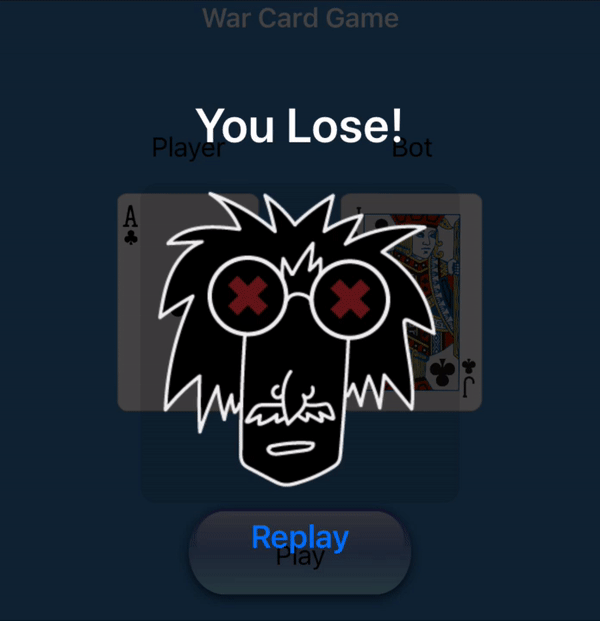
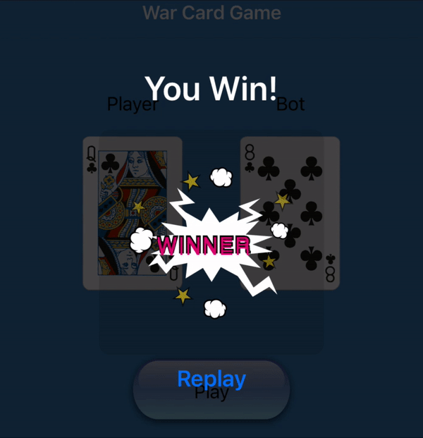

# War Card Game
SwiftUI, a card game with Lottie animations showing when winning or losing the game

# Menu
* [Features](#features)
* [To-Do](#to-do)
* [Source](#source)
* [Contributions](#contributions)
* [Contact](#contact)

# Features
Lottie animations:

### To-Do
* Fold the card when not playing

# Source
This game concept is inspired by [@CodeWithChris](https://twitter.com/CodeWithChris)'s SwiftUI beginner course with some extra features added myself.

Lottie's website: [Lottie](https://lottiefiles.com/)

# Contributions

* All kinds of contributions (enhancements, new features, documentation & code improvements, issues & bugs reporting & todo task) are welcome. Let's make it better.

# Contact
Created by [@ArgonYoYo](https://twitter.com/ArgonYoYo) - feel free to contact me!
